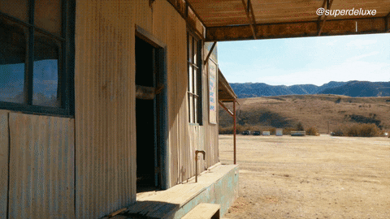

## Ejemplos de live events
Mira los siguientes eventos y responde: ¿qué está sucediendo?

### Ejemplo 1

* He passes the ball.
* Zidane sees the ball.
* He shoots and scores.

### Ejemplo 2

* She runs out of the house.
* She carries a gun.
* She jumps into a car.
* She flees from the scene.

### Ejemplo 3

* Bolt runs like his life depends on it!
* He makes it look like it’s a piece of cake!
* It seems the other participants fell asleep at the starting point!
* Bolt nears the finish line!
* As expected, Bolt wins the competition

---

## Connectors

* first
* to start with -> para empezar con
* first of all -> primero que todo
* for a start -> para empezar
* second
* third
* meanwhile -> at the same time
* later
* then
* next
* before/after
* during
* at this point
* eventually -> eventualmente | despues de un tiempo | mas adelante
* in the end
* finally

### Ejemplo: 

Rose is an upper-class woman who hates her relationship with her husband. **One day**, they go on a trip onboard a well-known ship. **While** sailing, she meets a poor man named Jack. They fall in love right **after** she threatens to jump off of the ship. They keep seeing each other, although Rose’s mother does not agree. **In the end**, the ship hits an iceberg and sinks. Jack dies. **Eventually**, Rose decides to tell this tragic love story to the world.

Jack is an old man who job in a work that he hates it. **One day** when he sleeps in his house, he hears a very strange sound that come from his livingroom. **In that moment** our hero knows everything.
