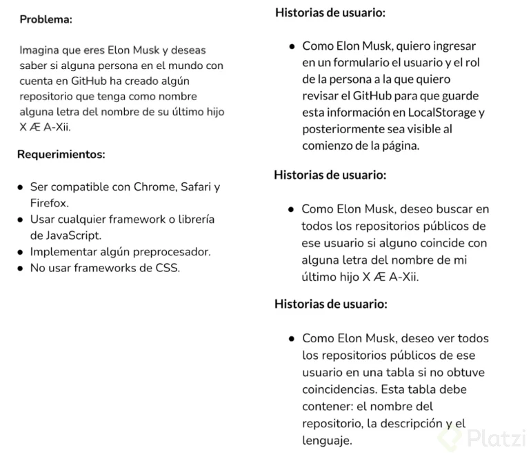

# Curso

https://github.com/h5bp/Front-end-Developer-Interview-Questions

https://github.com/thedaviddias/Front-End-Checklist

https://github.com/trekhleb/javascript-algorithms

## HTML y CSS

### A nivel práctico:

* Aprender las bases. Trata de entender cada cosa
* Crea pequeños componentes. ejemplo: un navbar
* Imaginar diferentes escenarios.
* Replica páginas web existentes

### A nivel teórico:

En HTML debes conocer:

* sintaxis
* tipo de etiquetas
* HTML semántico
* performance
* DOM

En CSS debes conocer:

* Modelo de caja
* Tipos de display
* Pseudo-clases
* Media queries
* Arquitectura
* Versiones
* Especificidad

## JavaScript

### A nivel teórico:

* Aprende las bases
* No te abrumes con Javascript. Sigue practicando
* Ten paciencia
* Arma un plan. Organízate
* 33 conceptos de Javascript que debes conocer

### A nivel práctico:

Haz mini proyectos:
* Consumo de APIs
* Replica funcionalidades de apps que te gusten
* Crea tu propio proyecto. Ej. Una página web
Cuando hagas un curso:
* Se espectador
* Trata de recordar
* Replica sin ver

## Frameworks

* Practica con baby steps
* Fundamentos
* Componentes
* Consumo de APIs
* Enrutamiento

## Live coding

* Muestra que piensas en el problema y analiza la situación.
* Piensa en voz alta. Te puede ayudar para que el entrevistador te de una mano si nota que estás * yendo por otro camino.
* No te des por vencido. Busca soluciones. ¿Cómo te enfrentas a problemas? Si no logras resolver el ejercicio la idea es que puedas demostrar que sabes cómo manejar esas situaciones difíciles. 
* Aprender a manejar la frustración, trabajar en soft skills.
* Resolución de problemas.
* Resolver problemas con codigo. 

Ejemplos de problemas:
* Cuántas veces se repite una palabra en una frase?
* Elimina los datos repetido de un array
* Mirar si hay dos números que sumen un número determinado
* Saber si una palabra es palíndromo
* Invertir una frase
* Adicional
* Manipulación del DOM
* Mostrar info de un JSON
* Slider
* Petición a API público
* Form que guarde local storage

## Recomendaciones generales para una entrevista técnica:

* Conseguir la entevista
* Prepárate y trabaja en las habilidades adecuadas para el rol que deseas desempeñar
* Es un proceso. 

### Tu día a día consta de:
* Codear
* Revisar el código
* Aprender nuevos trucos
* Las entrevistas están diseñadas para conocer tu potencial. Espera muchas preguntas en tu entrevista.

### Conocimiento consta de 3 cosas:
* Tu tiempo libre
* Tu pasión
* Tu experiencia
* Véndete a ti mismo

### Algunas posibles preguntas:
* Háblame de ti
* Cuéntame de tu experiencia

### Adicionalmente
* Muéstrate seguro
* No te dé miedo decir no sé
* Profundiza (no demasiado) en las respuestas
* Ten buena actitud
* Escucha sugerencias
* Sé puntual
* Prende cámara
* Haz preguntas sobre el empleo
* Sé honesto

## La entrevista puede ser teórica o práctica.

### A nivel teórico:

* Los temas serán sobre JS ( mayor importancia), CSS y HTML.
* Harán preguntas especificas del lenguaje, prepárate.
* Si sabes responde, no aparentar.
* Muéstrate seguro y tranquilo.
* En HTML preguntaran: accesibilidad, semántico y performance.
* Las preguntas estan diseñadas para medir tu conocimiento general

https://medium.com/@chen.reuven/the-ultimate-study-guide-for-front-end-interview-776fa3ead1b3

### A nivel práctico:

https://www.lapa.ninja/post/shopflamingo/
https://www.codingame.com/start
https://leetcode.com/

## Mejores prácticas para presentar entrevistas técnicas:

Los procesos de entrevistas varían dependiendo de cada una de las empresas a las que apliquemos, sin embargo, tener conocimientos sólidos de las diferentes tecnologías y conocimiento general de cómo serán estas entrevistas, pueden hacer que logremos procesos exitosos.

A nivel general, un proceso de entrevista está conformado por:

* Entrevista técnica
* Prueba técnica
* Entrevista cultural

También, pueden estar involucradas algunas llamadas telefónicas donde se conozca al candidato, se haga una negociación de salario, se hable de beneficios, se consolide la fecha de ingreso, entre otras.

### Entrevista técnica
* En este tipo de entrevistas, el entrevistador es quién hace preguntas o ejercicios en vivo para conocer tus habilidades técnicas en: HTML, CSS, JS, performance, accesibilidad, entre otras relacionadas con el desarrollo frontend.

* Para este tipo de pruebas, pregunta lo que no conozcas, trata de pensar en voz alta, que no te dé miedo decir “no sé” (aquí puedes decir algo como: “no sé, pero por lo que he oído sobre X puedo suponer que puede ser Y”, es decir, no solo digas “no sé” sino que trata de aproximarte a alguna respuesta), y muéstrate siempre como una persona a la que le gusta aprender.

Links de ejemplos de entrevistas técnicas:
- https://www.frontendinterviewhandbook.com/introduction
- https://github.com/h5bp/Front-end-Developer-Interview-Questions
- https://frontendmasters.com/guides/front-end-handbook/2018/practice/interview-q.html
- https://codeburst.io/clearing-your-front-end-job-interview-javascript-d5ec896adda4

### Prueba técnica
* Las pruebas técnicas son normalmente pequeñas aplicaciones para hacer desde casa en cierto tiempo y sin la presión de estar siendo observado(a). En este caso, confía en tus conocimientos y demuestra él(la) excelente desarrollador(a) frontend que llevas dentro. Elabora el mejor código limpio y con las mejores prácticas posibles, como también, realiza el 100% de los requerimientos solicitados. Si no entiendes algo del problema, ten la confianza y seguridad de preguntarles (¡ellos van a ser tus futuros compañeros de trabajo!) para lograr el mejor resultado tanto visual como funcional.

* En este tipo de pruebas, también notarás si eres apto(a) o no para el cargo al que estás aplicando.

* Si ves que te demorás más del tiempo solicitado o si ves la necesidad de pedirle ayuda a alguien, es mejor que des un paso atrás y considera este proceso como aprendizaje para detectar en qué cosas aún debes profundizar, y como una experiencia más que te da la oportunidad de mejora para el futuro.

### Entrevista cultural
* Esta entrevista parece ser la más sencilla de todas, pero no la subestimemos. En esta entrevista (aunque te haya ido muy bien en las entrevistas anteriores) puede hacer que el entrevistador desista de una posible contratación.

* Lo ideal para esta entrevista es demostrar que somos él(la) candidato(a) perfecto(a) para ese puesto, aquí debemos impresionar con nuestro perfil y nuestras capacidades. Para ello, prepara:

* Un breve párrafo sobre quién eres y sobre tu trayectoria.
Una lista de cosas importantes que has logrado en tu carrera como desarrollador(a) frontend (features que hayas realizado y de los que te sientes muy orgulloso(a)).

* Una lista de errores que hayas cometido y la correspondiente solución que le diste a cada uno.

* Pregunta sobre la empresa y sobre el proceso para demostrar tu interés. Estas pueden estar relacionadas con la forma de trabajo, la conformación de los equipos, tecnologías con las que trabajan, etc.

En las pruebas técnica hay 2 escenarios generalmente:

Una prueba con solo el problema

Darle solución a nivel de:

* Código
* UI

Nos compartan un diseño + planteamiento del problema:

* Primero haz que funcione y luego lo pones bonito.
* Si tiene diseño, cuida cada detalle. La extensión **PerfectPixel** te puede ayudar con eso.
* Entregarla en el tiempo acordado.
* Cumple con el 100% de los requerimientos.
* Trata de hacer el deploy. Puedes usar github pages para esto, también está Netlify.
* Haz tu código 100% en inglés. Si necesitas agregar comentarios en tu codigo deberia estar en inglés.
* Usa las mejores practicas.
* Haz un buen README.

## Preguntas y respuestas sobre pruebas técnicas en casa

### ¿Se puede conseguir empleo sin conocer frameworks?

* Es muy difícil. Porque el que solo trabajen con HTML, CSS y Javascript puede significar que estén trabajando con algo muy antiguo. Aunque muchas empresas requieren un experto en Javascript más que en nu framework.

### ¿Es recomendado estudiar Javascript a profundidad o a un framework?

* Si no tienes conocimientos sólidos en Javascript era muy difícil adaptarte a un framework. Es recomendado concentrarnos más en javascript en una primera instancia y luego ver temas de frameworks.

### ¿Es valido consultar en internet algunas dudas de sintaxis, mirar ejemplos, etc?

* Muchas veces puede ser visto como un acto de deshonestidad porque están evaluando tus conocimientos y no tanto tus habilidades para buscar en internet, sin embargo lo que sí se puede hacer es preguntar si puedes buscar algo muy particular que no recuerdas, o un sé que es por este lado pero déjame checo y me acuerdo. Comunícate siempre

### ¿Cómo preguntar o descubrir cuál sería nuestra carga laboral en esa primera oportunidad?

* Es muy posible que pases por la etapa del On Boarding (1 o 2 semanas), en la que te presentan el proyecto; cómo trabajan, cuáles son los lenguajes que ocupan. Pura lectura, mirar el proyecto, cómo funcionan los equipos, sus metodologías ágiles.

* Te encargarán trabajar con historias de usuario que al principio no serán tan pesadas; evaluarán cuánto te demoras en esas tareas.

En startups casi siempre hay demasiado trabajo.

### ¿Cómo identificar ofertas laborales malas?

Depende de qué estés buscando en un trabajo o en una empresa.

* Valores
* Principios
* Equipo comunicativo
* Empatía
* Cordialidad
* Transparencia
* Honestidad
* Si no está claro lo que están buscando en la oferta laboral, tal vez no sea ahí.

https://github.com/lydiahallie/javascript-questions

https://html.com/resources/front-end-dev-interview/