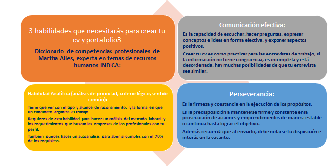

# Curso creacion del cv

* Portafolio + CV: Siempre enviar Portafolio + CV para ahorrar tiempo y demostrar en el Portafolio el trabajo que se describe en el CV, todo esto con la finalidad de que, si llegase a existir un interés por nuestro perfil, la empresa pueda verificar de inmediato el trabajo que hemos realizado.

* Es importante coordinar el currículo con el Portafolio

* Currículo o Curriculum Vitae: Documento profesional donde se destacan habilidades, conocimientos y experiencias. El reclutador tarda en promedio 3 minutos observando un currículo y se enfoca principalmente en la fotografía, en el título, el objetivo profesional y el trabajo más reciente.

* Portafolio: Herramienta para mostrar experiencia y conocimientos de manera visual. Te permite demostrar de manera visual lo que se describe en el currículo.

## Objetivo, estructura y contenido del portafolio

* Importancia: Es añadir la información que habla sobre mi trabajo más relevante para el empleo que busco y dar énfasis en ello.
Consiste en describir de manera concisa las actividades de mis trabajos anteriores que son relevantes para el puesto al que estoy aplicando.

* Estructura escrita/visual: Debe ser puntual, con textos con buena cohesión y coherencia lógica y temporal, con excelente ortografía y elocuentes. Visualmente debe ser navegable a los ojos, y que vaya acorde a la persona que somos.

* Información clave: Hay información puntual que los reclutadores observan, nombre, teléfono contacto, trabajos cronológicamente organizados o por prioridad, siempre la información de mayor interés en las primeras hojas.

## ¿Qué es un cv?

Tu CV hablará de lo que sabes hacer y tu portafolio lo demuestra.

Principales diferencias:
### CV:	
* Una guía de tu trayectoria laboral.
* Detalla conocimientos y experiencia	
* Habla de tus estudios y capacitación
* Dos hojas o más

### Hoja de vida: 
* Es un resumen de tu trayectoria laboral
* Habla solo de proyectos relevantes de tu experiencia más reciente.
* Habla solo de proyectos relevantes de tu experiencia más reciente
* Solo una hoja

Para determinar el objetivo laboral se deben contestar las siguientes preguntas:

¿Quién soy?
¿Qué tipo de trabajo quiero hacer?
¿Cuáles son mis habilidades?
¿Qué es importante para mí?
¿Cuál es mi principal diferenciador?
Es importante redactar en 3 reglones el alcance del puesto y posteriormente los logros profesionales a través de la metodología SOAR que demuestre las competencias y/o habilidades que se emplearon.

S- Situación
O- Osbtáculo
A- Acciones realizadas
R- Resultado

Los logros deben ser medibles. ¿Que hicé? ¿Qué beneficios tuvo para la empresa?

## Paginas para crear el cv
* https://novoresume.com
* https://www.resumemaker.online
* https://www.canva.com
* https://www.cvmaker.com

## Redaccion del cv por seccion

Datos de contacto. Agrega datos de contacto no información personal.

Objetivo. Se adapta al puesto al que queremos optar. Las cualidades y aptitudes que destaquemos de nosotros mismos deben ir acordes a este.

Contesta estas preguntas:

* ¿Qué quiero hacer?
* ¿Qué ofrezco?
* ¿Por qué lo puedo hacer?

Información académica. Agrega tus estudios más recientes y relevantes para el puesto que buscas.

Experiencia profesional. Agrega tus actividades iniciando con la de mayor importancia. Trata de resaltar las actividades relacionadas a las que indican en la vacante de tu interés.

Información adicional:

* Personal. Fechas de nacimiento, disponibilidad para viajar o cambiar de residencia, hobbies.
* Técnica. Idiomas, software, Cursos o talleres.

CV de ejemplo:
https://www.canva.com/design/DADXUVX_N4M/view

https://zety.com/blog/best-fonts-for-resume

## ¿Quiénes son los reclutadores y cómo piensan?

Si estás en búsqueda de un nuevo empleo o a lo largo de tu vida profesional, seguramente tendrás contacto con un reclutador. Por ello es importante que tengas algunas referencias de estos profesionales para que te sientas en confianza y sea una ventaja al momento de que se pongan en contacto contigo. Ellos ya conocen tus antecedentes profesionales por tu cv y saben más de ti que tú de ellos.

Por lo regular un reclutador trabaja en un área de recursos humanos. Su formación profesional coincide con administración de empresas, psicología o técnicos en reclutamiento, en algunas ocasiones son comunicadores con especialidad en recursos humanos y para el sector de reclutamiento de perfiles de tecnología hay licenciados en sistemas y hasta expertos en marketing.

Es importante que sepas que los reclutadores pocas veces aprendemos a reclutar en la universidad, en la mayoría de los casos es mediante la práctica o con cursos especializados, especialmente en el caso de los procesos reclutamiento por competencias.

No solamente nos dedicamos a hacer entrevistas todo el día, la mayoría de las veces también hacemos actividades muy administrativas como crear bases de datos con toda la información que nos llega de los candidatos, gestionamos expedientes y nos encargamos del papeleo para que puedas ser contratado una vez que ha sido seleccionado como el candidato para ocupar un cargo.

Tenemos muchas juntas con clientes o jefes para completar un documento que se llama requerimiento de personal en el cuál está el detalle de todo lo que debemos de buscar en este nuevo candidat@. Como reclutadores debemos ser muy observadores para identificar todo lo que pueda ser de utilidad al entrevistar a nuestros candidatos, es decir, información que no siempre se agrega a un documento de requerimiento pero que puede ser muy importante para que tu aceptes o no una oferta de trabajo como: ¿qué tan accesible es llegar al lugar de trabajo en transporte? y ¿cuales son las vías de acceso?, si el equipo de trabajo es de muchas o pocas personas, si hay un espacio para que puedas comer en la oficina o no, si el código de vestimenta es formal o informal… etc. En fin, todos esos detalle que sabemos que te pueden hacer sentir a gusto en un nuevo lugar de trabajo.

Para que te puedan llegar las ofertas de trabajo tenemos que hacer una gran labor como: agregar la oferta de trabajo en diversas bolsas de trabajo, agregarlo a redes sociales y grupos de facebook y grupos de whatsapp, vamos a eventos de tecnología para conocer developers, stalkeamos un poco por Linkedin, en fin; hacemos todo lo necesario para llegar a nuestros candidatos.

En lo que invertimos más tiempo; es en revisar la curricula, portafolios y demo-reels que nos llegan ¡en verdad son muchos al día! por lo que desarrollamos una habilidad para la lectura donde nos guiamos por palabras claves, es decir; quiero ver en tu cv lo que indica el requerimiento de mi cliente como el software que dominas, habilidades, conocimiento y experiencia.

Es muy importante que la comunicación sea clara en tu cv ya que evaluamos cómo transmites tus ideas de forma escrita; si hay faltas de ortografía o la redacción no es clara, podemos pensar que seguramente en persona no hablarás de una manera profesional.

Ya que conoces un poco más de nosotros los reclutadores, quiero darte algunas recomendaciones para que tengas una excelente experiencia con los reclutadores o buscadores de talento.

Conocelo antes de la entrevista:
Por lo regular cuando se agenda una entrevista, ya te ha dado su nombre o te ha mandado un correo. Buscalo por Linkedin y revisa su perfil, seguramente te puedes dar una idea de su personalidad al ver sus publicaciones y su foto.

Prepárate para las preguntas:
Es muy sencillo, solo tienes que revisar la vacante para la cual te postulaste, seguramente las preguntas técnicas serán con relación a lo que viste en el anuncio de la oferta laboral.

Deja que el reclutador lleve la entrevista:
Sabemos que la entrevista será sobre ti y de lo que sabes, pero trata de que tus respuestas no sean muy largas, solo lo necesario para que se entienda muy bien tu idea, no des contexto innecesario. Lo ideal es que la entrevista no sea muy extensa.

Da seguimiento por escrito:
Es muy probable que si llamas al reclutador para dar seguimiento, este se encuentre entrevistando por lo que te recomiendo que envies un correo o mensaje de whatsapp si tienes su número.

Muestra una excelente actitud:
Para nosotros, los candidatos con buena actitud se convierten en personas memorables por lo que si en ese momento no calificaste para ese puesto, seguro te mantendrá en su radar o te recomendará con otros colegas.

https://desdemipsique.blogspot.com/2021/07/estrategias-para-optimizar-tu-perfil-en.html

---

### Dos consejos VALIOSOS que aprendí de un staff de reclutamiento y hoy te comparto con muchísimo gusto
* Imagen y lenguaje corporal: Es importante que, tengan o no un código de vestimenta, asistas con la vestimenta adecuada y que al hablar seas seguro y tu lenguaje corporal brinde confianza.

* Actitud: Es importante que muestres emoción al hablar sobre tu trabajo, sobre lo que te apasiona, algunas empresas como Apple en sus entrevistas de trabajo consideran la actitud como un FACTOR CRÍTICO…

Canales de Youtube que hacen revisiones de dif desarrolladores, tienen muy buen contenido.

https://www.youtube.com/channel/UC46wWUso9H5KPQcoL9iE3Ug

https://www.youtube.com/user/Tychos1