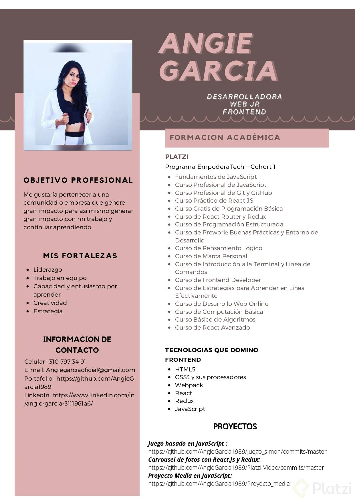
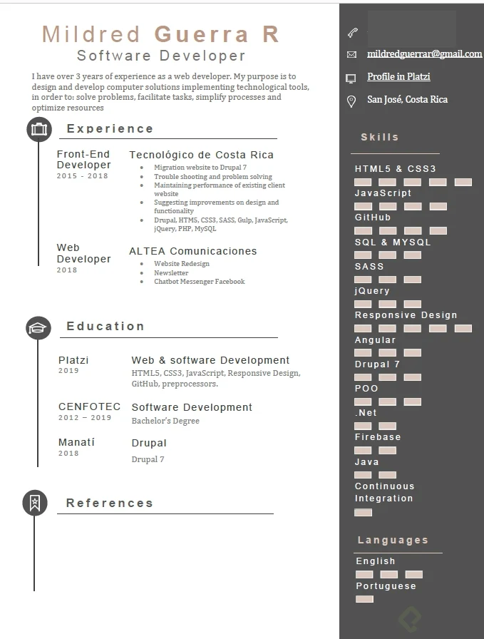

# Feedback a CV

* Evita filigranas en la imagen. Quitaría el sombreado que has colocado y la dejaría encuadrada lo más minimalista posible.

* Una foto en la que sonríes, aunque sea sutilmente, tiene muchas más posibilidades de empatizar contigo.

* En objetivo profesional evitaría usar la palabra impacto 2 veces. Tira de diccionario de sinónimos.

* En información de contacto, trata de poner las versiones abreviadas de los enlaces, verás que queda mucho más limpio.   **Ejemplo:**   El http a día de hoy sobra. En Linkendin, modifica el encabezado y el usuario para que quede más profesional. Verás que en Google hay blogs que te indican como hacerlo y que tener en cuenta en LinkendIn.

* Cuidaría la letra y trataría de que no fuera infantil. Busca en google “tipografías para curriculum” por ejemplo.

* Haz que los enlaces a tus proyectos sean lo más acortados posibles y clicklables. Existen muchos acortadores online que harán que tu CV luzca como una estrella.

---

Invierte el orden de tu profesion por el de tu nombre, recuerda que las palabras Desarrollo web son palabras clave y te ayudaran a salir de primeras en las búsquedas. veo bien redactada tu experiencia profesional aunque no estoy segura de que tengas el mismo tipo de letra en todo el cv, es importante omologar ya que los líderes técnicos se fijan en estos detalles y más para alguien que se dedique a front. Serpia idela que agreugues alguna liga para ver tu trabajo. Mi tema cuando los candidatos agregan barras o estrellas o circulos para expresar su nivel de dominio de una herramienta es que no entiendo si casi lleno es avanzado o medio, te sugiero que agregues con palabras el nivel como Básico, intermedio o avanzado. 
